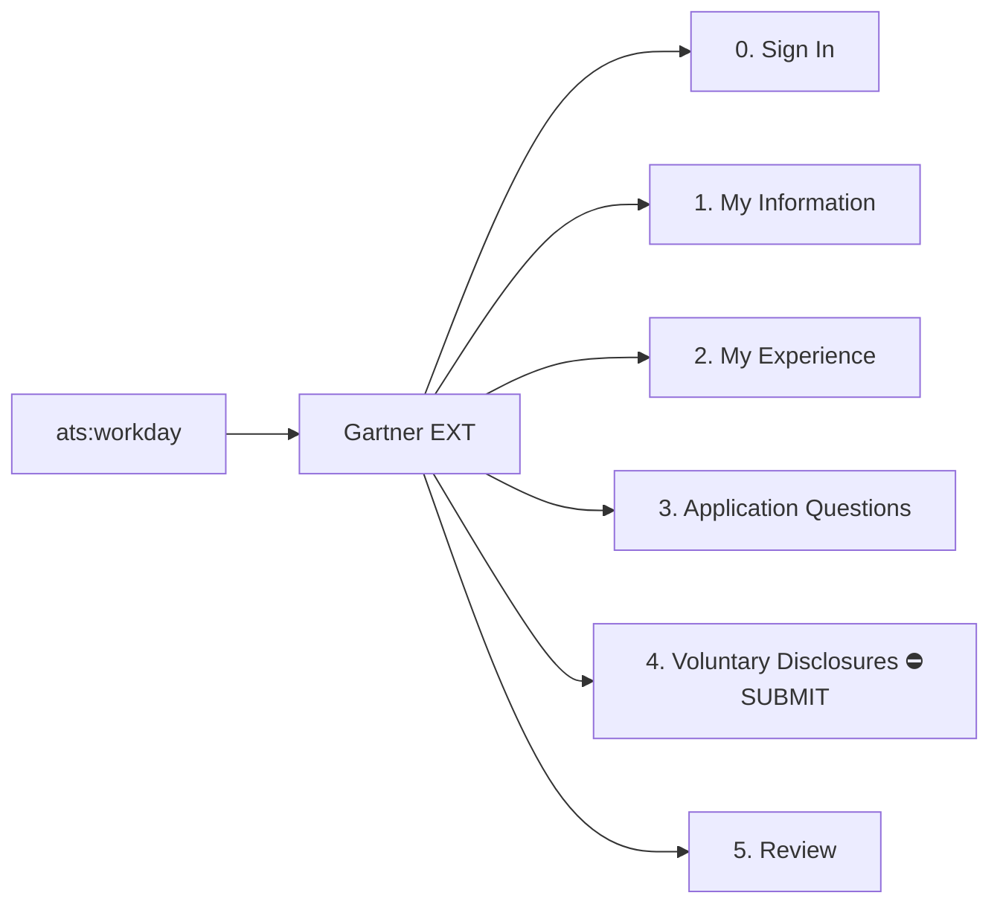

# Application Memory Graph

> Generated by `kb/harvest.py --render-only`. Source of truth is `kb/graph.json`.

**179 nodes · 193 edges · 1 application(s) · 1 tenant(s)**

## Reuse layers

| Layer | Scope | Count | Reused by |
|---|---|---|---|
| Canonical fields | universal | 29 | every application |
| Answer bank | universal | 9 | every application |
| Constraints | per ATS product | 3 | every tenant of that ATS |
| Selectors | per tenant | 29 | every req in that tenant |
| Guards | global | 11 | every run |

## Submit boundaries — read before clicking anything

- `tenant:gartner.wd5/EXT` → continue submits at **step 4 — Voluntary Disclosures**

## Guards

| ID | Guard | Rule |
|---|---|---|
| G1 (3) | terminal-step guard | Before any continue click, resolve is_terminal_submit for the step. If true, refuse: dump footer buttons and progress bar, print the submit one-liner, exit. ALLOW_SUBMIT=1 is the only override and automation never sets it. |
| G2 (6) | upload integrity | Assert magic bytes match the declared type, byte count equals the local source, filename is distinct and candidate-named, and the post-upload DOM shows success plus the expected size. Abort on any mismatch. |
| G4 (1) | session batching | One batched interact call per form step. Firecrawl live sessions die after ~10 min idle. |
| G5 (1) | no blocking question with an open session | Never pause for a human answer while a session is live. Resolve from the answer bank, or finish every other field and ask at the end. |
| G6 (5) | error harvest | After every save, grep page innerText for lines starting with 'Error'. Workday does not put validation text in errorMessage or role=alert. Any new error becomes a constraint node. |
| G7 (7) | option resolver | Never type a value into a dropdown. Enumerate the field's own options, fuzzy-match, record a maps_to edge. Below the similarity floor, queue a question. |
| G8 (2) | semantic ambiguity guard | Profile keys marked ambiguous, or whose value conflicts with the job's country, escalate before any field is typed. |
| G9 (3) | resume/profile consistency pre-flight | Diff parsed resume against user_profile.json. Any role, title or date-granularity mismatch blocks the run until reconciled. |
| G10 (1) | credit measurement | Measure unit cost over at least 5 calls before extrapolating. A single 0-delta reading is noise. |
| G11 (1) | attestation guard | Fields matching /e-?signature|certify|I verify|consent/i are classed attestation: filled only under the hard-stop flow and listed explicitly in the handover report. |
| G12 (1) | profile writer lock | One writer per browser profile. Concurrent readers must pass --no-save-changes. |

## Pitfalls by severity

### fatal (3)

- **A1** → `G1` — Application submitted with no human review: 'Save and Continue' on step 4 of 5 WAS the submit. The progress bar's step 5 'Review' is a post-submit confirmation screen.
- **A2** → `G2` — Resume uploaded as a 2.6 KB HTML error page named resume.pdf. Workday accepted it silently. Magic bytes were never checked.
- **E1** → `G8` — work_authorization_sponsorship: 'Yes' is semantically ambiguous. Taken literally it would have submitted a disqualifying answer for an India-based role.

### high (6)

- **A3** → `G11` — T&C e-signature checkbox ticked automatically. It attests the application is true and complete.
- **C2** → `G2` — The tmpfiles token is IP-bound. Resolved locally it yields HTML in the cloud sandbox. Must be resolved inside the sandbox.
- **D1** → `G6` — Role Description rejects < > [ ] { } " and backslash: 'Contains illegal characters'. Discovered only after a failed save.
- **D3** → `G6` — Validation errors are NOT in errorMessage or role=alert. aria-invalid=true elements have empty text. Only reliable read is innerText lines starting with 'Error'.
- **D9** → `G7` — Honeypot input present: 'Enter website. This input is for robots only, do not enter if you're human.' Filling it flags the application as a bot.
- **E2** → `G9` — Symx AI is in work_ex_details.md but not on the attached resume PDF. Now permanent on a live application.

### medium (11)

- **B1** → `G4` — Live session died after ~10 min idle; two sessions lost mid-run.
- **B2** → `G5` — Asked the human a question with a live session open. Session died, costing a reconnect and a step re-walk.
- **C1** → `G2` — tmpfiles.org /dl/<id>/<name> returns HTML, not the file. The real link is a tokenized href inside that page.
- **C3** → `G2` — urllib from the Python sandbox gets HTTP 403 from tmpfiles. curl from the bash sandbox works.
- **C5** → `G2` — Two uploads with the same filename were indistinguishable; could not tell which one landed.
- **D2** → `G6` — LinkedIn URL must contain www. 'https://linkedin.com/in/...' is rejected with 'Invalid LinkedIn URL'.
- **D4** → `G7` — Searchable prompts do not filter when you type into the field: they return the first 100 alphabetically. Must use promptSearchButton then the Search box then Enter.
- **D7** → `G7` — Option label mismatches: Mobile -> Personal Mobile, Computer Science -> Computer and Information Science, B.Tech -> Bachelor's Degree.
- **E3** → `G9` — Symx AI dates had no months ('2024 - 2025'); months were invented as 01/2024-12/2025.
- **F1** → `G1` — The DRY_RUN gate the plan mandated was skipped; the run was driven ad hoc.
- **F3** → `G6` — Sanitization was designed only after the server rejected the input.

### low (10)

- **B3** → `G10` — Concluded interact was free from one 0-delta credit reading. Actual ~2 credits/call.
- **B4** → `G12` — 'Another session is currently writing to this profile' when two scrapes shared --profile.
- **C4** → `G2` — Four upload hosts burned before one worked: file.io dead, 0x0.st unreachable, litterbox 403, bashupload DNS failure.
- **D10** → `G7` — Several add-buttons share one automation-id, separated only by nth index.
- **D11** → `G6` — candidateHome renders a phantom '1 error' banner after a direct goto. Benign.
- **D5** → `G7` — promptOption matched a different widget's options than intended. Enumeration must be scoped to the field's own container.
- **D6** → `G7` — data-automation-id sits on wrapper DIVs, not on inputs. Must descend to input/textarea/button.
- **D8** → `G7` — agent-browser snapshot refs go stale after any DOM change. Refs for reading, automation-ids for acting.
- **E4** → `G9` — Cambridge title differs: profile 'Research Associate' vs resume 'Research Apprenticeship'.
- **F2** → `G1` — apply_orchestrator.py was written after the run it was meant to drive.

## Answer bank

| Question | Answer | Confidence | Decided by |
|---|---|---|---|
| Are you currently a Gartner license user? | **No** | high | agent |
| Are you currently being considered for a job or have you recently applied at Gartner? | **No** | high | agent |
| Are you currently employed by Gartner? | **No** | high | agent |
| Are you currently subject to a non-competition or non-solicitation agreement that could… | **No** | medium | agent |
| Has Gartner employed you in the past? | **No** | high | agent |
| Have you previously worked for this organization? | **No** | high | agent |
| In your current role, are you involved in procuring, negotiating, approving, or influen… | **No** | high | agent |
| Will you, now or in the future, require Visa/Sponsorship within the country for which y… | **No** | high | user |
| Yes, I have read and consent to the Terms & Conditions above. | **CHECKED** | high | agent |

## Upload hosts

| Host | Status | Last ok | Last fail |
|---|---|---|---|
| tmpfiles.org | ok | 2026-08-02 | — |
| 0x0.st | fail | — | 2026-08-02 |
| bashupload.com | fail | — | 2026-08-02 |
| file.io | fail | — | 2026-08-02 |
| litterbox.catbox.moe | fail | — | 2026-08-02 |

## Tool facts

- `firecrawl.interact_cost` — interact costs ~2 credits per call. Measured over the whole run: 66 credits for 4 scrapes + 1 parse + ~30 interacts.
- `firecrawl.profile_lock` — One writer per --profile at a time. Readers need --no-save-changes.
- `firecrawl.sandbox_net` — The bash sandbox has outbound internet and a writable /tmp. curl works; urllib from the python sandbox is blocked by some hosts (403).
- `firecrawl.sandbox_upload` — agent-browser upload <selector> <path> puts a sandbox file into a page file input. Playwright set_input_files works identically.
- `firecrawl.scrape_cost` — scrape = 1 credit. parse = ~1 credit per PDF page. --query = +5.
- `firecrawl.session_ttl` — Firecrawl live sessions expire after roughly 10 minutes idle.
- `workday.phantom_error` — candidateHome shows a '1 error' banner after a direct goto. Benign.
- `workday.step_persistence` — Workday persists each step on Save and Continue, so a reconnect can walk forward through completed steps and resume cleanly.

## Shape

