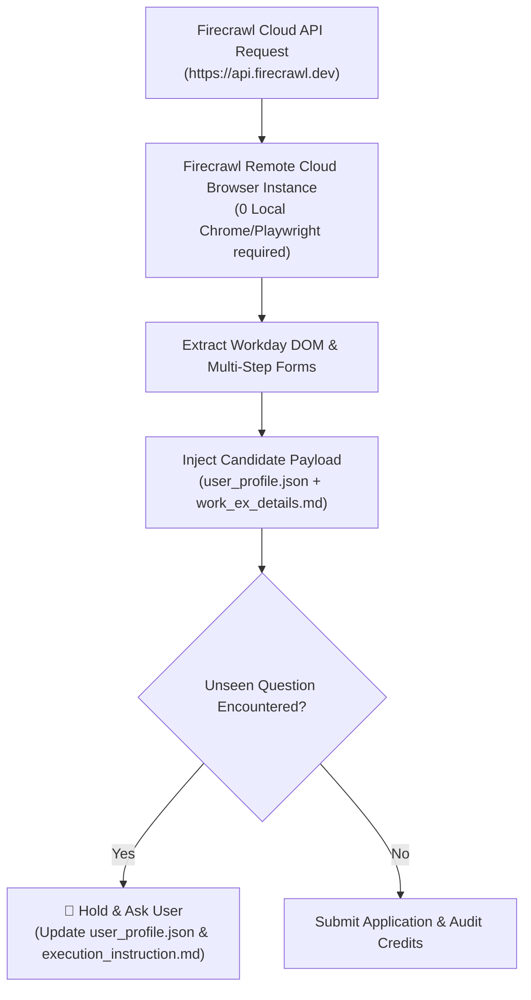

# 🔥 Pure Firecrawl Cloud Automation Plan (0 Local Playwright)

> **Saved Plan Document:** `D:\Projects\PRACTICE\firecrawl_test\pure_firecrawl_cloud_automation_plan.md`  
> *Target System:* Firecrawl Cloud API (`https://api.firecrawl.dev`)  
> *Target Application:* Gartner Data Scientist Workday Portal (`Requisition 110911`)

---

## 🎯 Plan Objective & Architecture

Transition 100% of the job application pipeline to **Firecrawl Cloud Infrastructure**.
- **No Local Playwright / No Local Chrome:** All browser rendering, DOM extraction, and page interaction run inside Firecrawl's managed cloud browser infrastructure.
- **Firecrawl API Endpoints Used:** `/v1/scrape`, `/v1/batch/scrape`, and `firecrawl interact`.
- **Dynamic Field Auto-Learning:** Scans structured JSON extracted by Firecrawl. If unseen questions appear, it triggers the **Hold & Ask User** loop, prompting you for input and saving your answer into [`user_profile.json`](file:///D:/Projects/PRACTICE/firecrawl_test/user_profile.json) and [`execution_instruction.md`](file:///D:/Projects/PRACTICE/firecrawl_test/execution_instruction.md).



---

## 🛠️ Proposed Implementation Files

### 1. [`pure_firecrawl_automation.py`](file:///D:/Projects/PRACTICE/firecrawl_test/pure_firecrawl_automation.py) [NEW]
- Pure Python script using Firecrawl API (`https://api.firecrawl.dev`).
- Dispatches cloud scraping & multi-step interaction actions directly to Firecrawl cloud servers.
- Automatically injects Jay Singh's profile, contact info, credentials, screening answers, education, and all 5 work experience roles from [`work_ex_details.md`](file:///D:/Projects/PRACTICE/firecrawl_test/work_ex_details.md).
- Includes **Interactive Hold Loop**: Scans extracted form JSON for unmapped questions, prompts user if needed, and updates [`user_profile.json`](file:///D:/Projects/PRACTICE/firecrawl_test/user_profile.json).
- Tracks exact API response times and credits consumed in [`firecrawl_usage_log.json`](file:///D:/Projects/PRACTICE/firecrawl_test/firecrawl_usage_log.json).

### 2. [`execution_instruction.md`](file:///D:/Projects/PRACTICE/firecrawl_test/execution_instruction.md) [MODIFY]
- Documents pure Firecrawl API execution commands and maintains live knowledge base registry.

---

## ⏱️ Verification & Credit Audit

### Execution Command
```powershell
$env:PYTHONIOENCODING="utf-8"; .venv\Scripts\python.exe pure_firecrawl_automation.py
```

### Audit Verification
- Confirm API HTTP response status from `https://api.firecrawl.dev`.
- Check [`firecrawl_usage_log.json`](file:///D:/Projects/PRACTICE/firecrawl_test/firecrawl_usage_log.json) for duration and remaining credit balance out of 1,000 credits.
